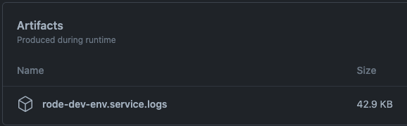

# rode-dev-env

[](https://github.com/rode/rode-dev-env/actions/workflows/test.yaml)

[](https://github.com/rode/rode-dev-env/actions/workflows/release.yaml)

A local development and CI environment for Rode and its components.  

## Local

To start Rode, run `docker compose up`. This will stand up Open Policy Agent, Elasticsearch, Grafeas, and Rode.

To shut everything down, use `docker compose down`.

## GitHub Action

This repository includes a GitHub Action to run Rode in a CI environment. It handles setting up Rode and its dependencies,
and will automatically tear it down in a post step. 

For debugging, logs from the services are attached to each run:



### Inputs

The only action inputs are for configuring service versions:

| Input                  | Description                                                         | Default  |
|------------------------|---------------------------------------------------------------------|----------|
| `rodeVersion`          | Rode version. Set this value to `local` to use a binary in `$PATH`. | `0.14`   |
| `elasticsearchVersion` | Elasticsearch Docker image tag.                                     | `7.10.0` |
| `grafeasVersion`       | Grafeas Elasticsearch Docker image tag.                             | `0.8`    |
| `opaVersion`           | Open Policy Agent Docker image tag.                                 | `0.24.0` |

### Outputs

The action outputs addresses for the running services:

| Output             | Description                                       |
|--------------------|---------------------------------------------------|
| `rodeHost`         | Rode hostname and port. No protocol.              |
| `elasticsearchUrl` | Elasticsearch URL.                                |
| `grafeasHost`      | Grafeas Elasticsearch host and port. No protocol. |
| `opaUrl`           | Open Policy Agent URL.                            |


### Example

```yaml
- name: Start Rode Environment
  uses: rode/rode-dev-env@v0.1.2
  id: rode
- name: List Rode Policies
  run: |
    curl http://${{ steps.rode.outputs.rodeHost }}/v1alpha1/policies | jq
```

## Development

### Local

The action has two stages: main and post. Main starts Rode and its dependencies, while post tears down the services and
uploads logs. To run a stage, use `./scripts/main.sh` and `./scripts/post.sh` respectively. Some state isn't kept between
runs (e.g., logs directory, PIDs), so the behavior will be different running locally. 

To change the version of the components, update the input values in `scripts/common.sh` (the action.yaml file isn't referenced
when running locally).

In order to test changes in GitHub Actions, run `./scripts/build.sh`, commit the result, and run a workflow that references this action.
There is also a test workflow that simply runs the action and checks that Rode starts.

### Releases

The process for releasing this action is different from other Rode projects, because we have to build the JavaScript
bundle, commit it, and only then tag the release. The current process is below:

1. Bump the version in `package.json`
1. Commit and push to `main`
1. Kick off the release workflow manually

The workflow uses `scripts/build.sh` to invoke [esbuild](https://esbuild.github.io/), then commits and tags the result.  
